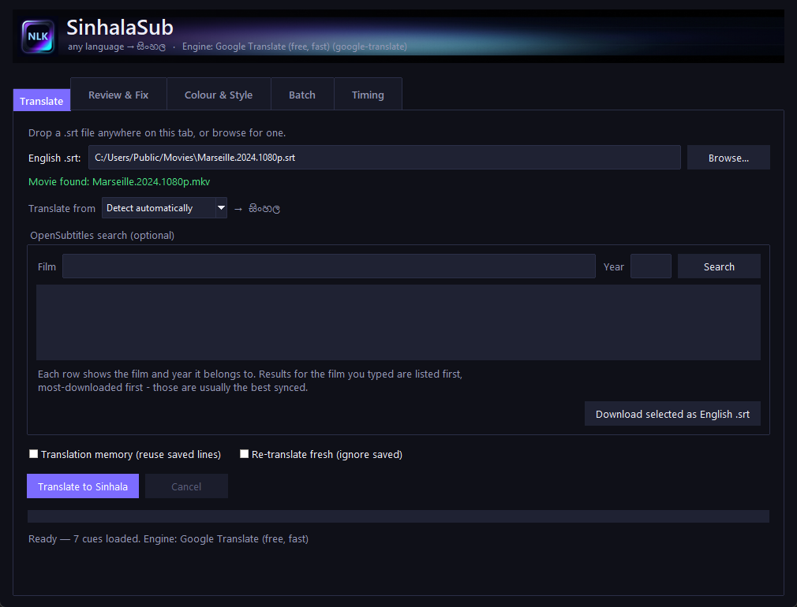
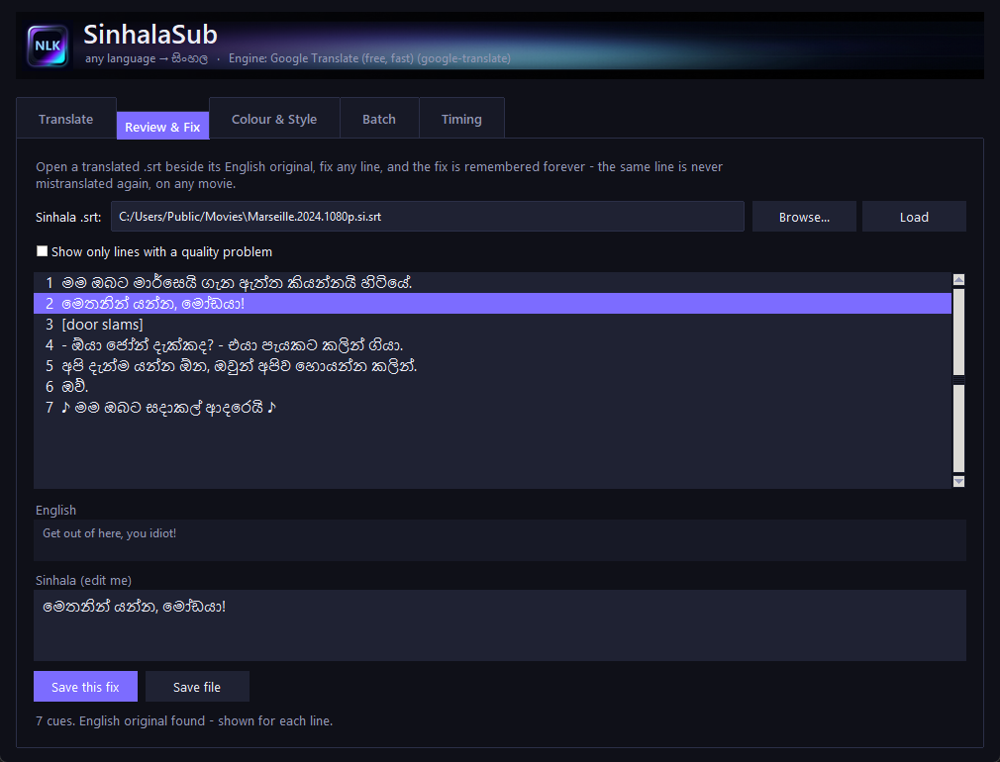
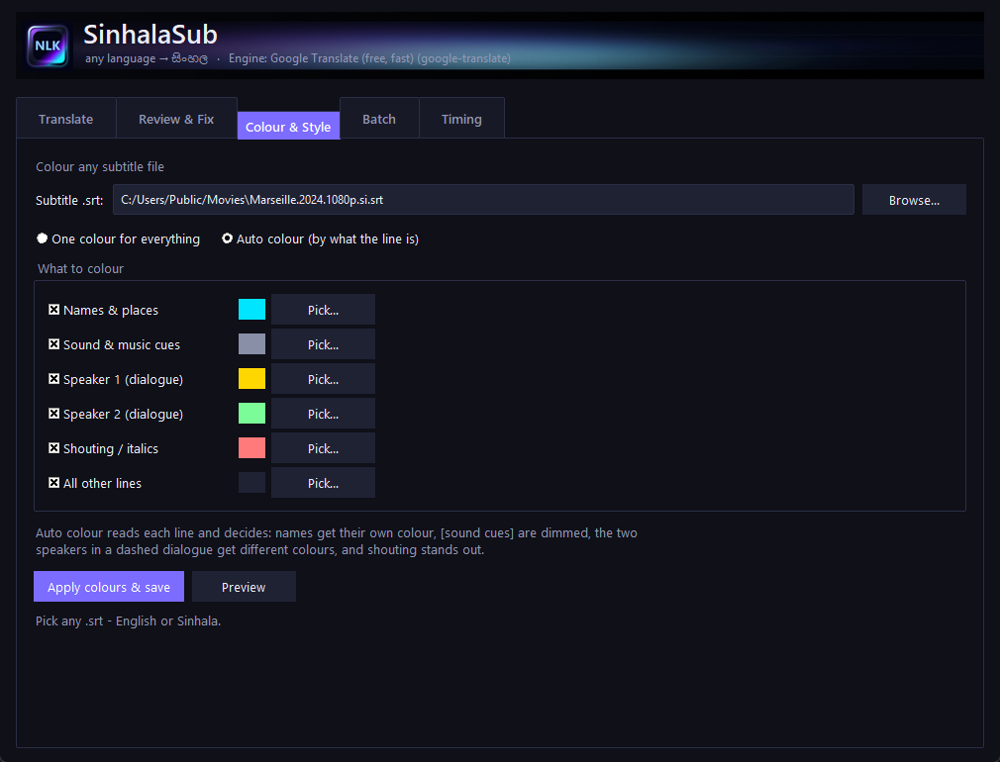
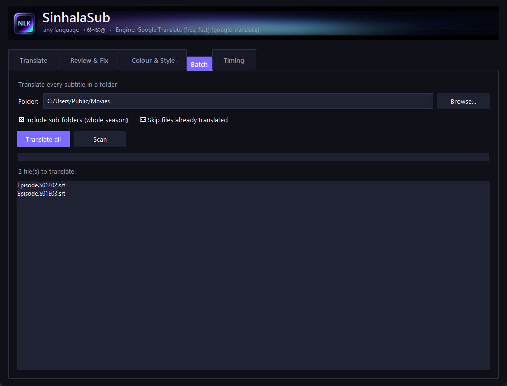
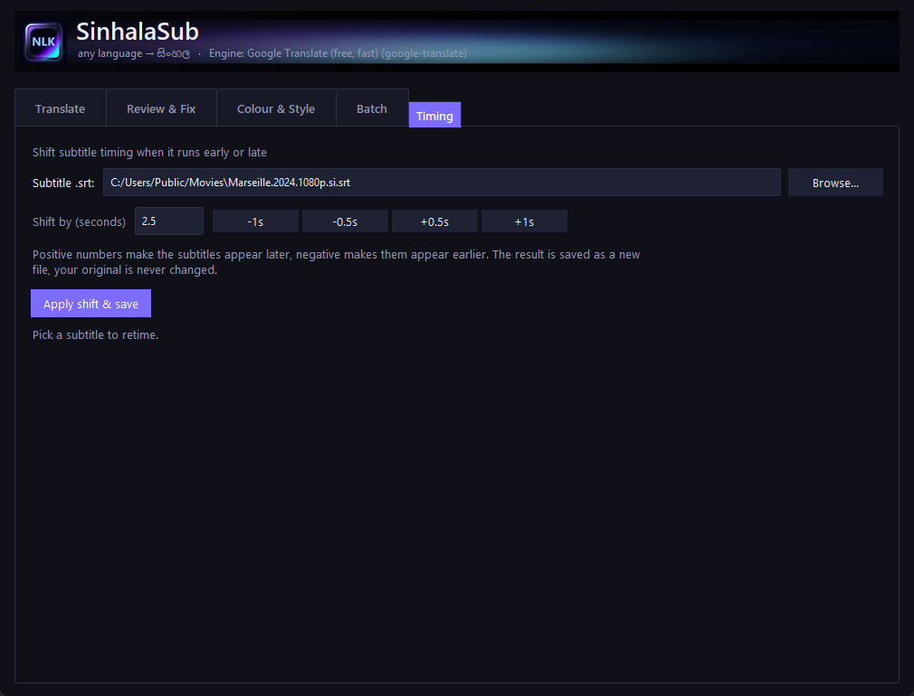
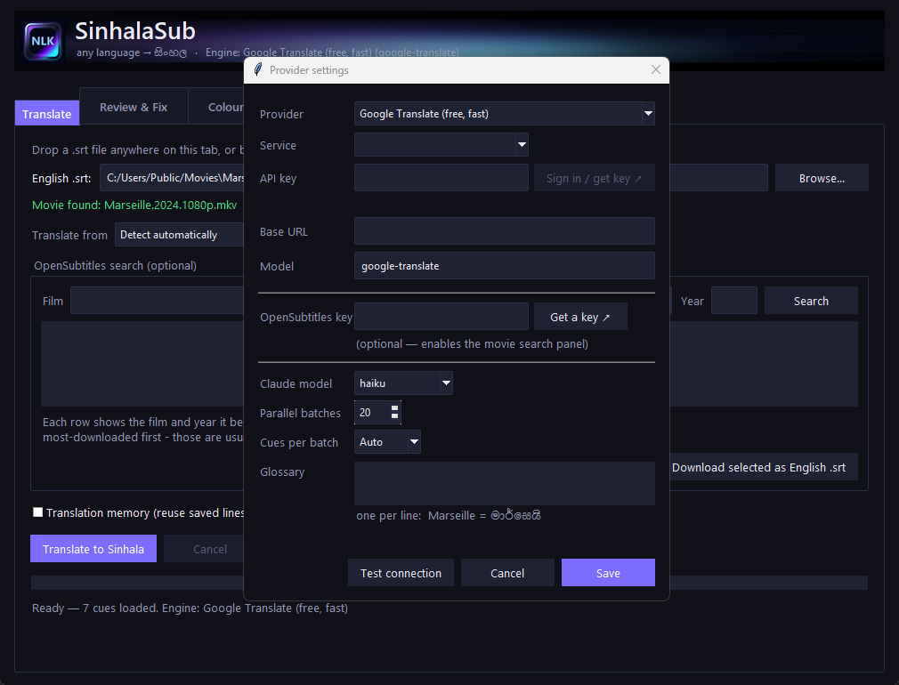
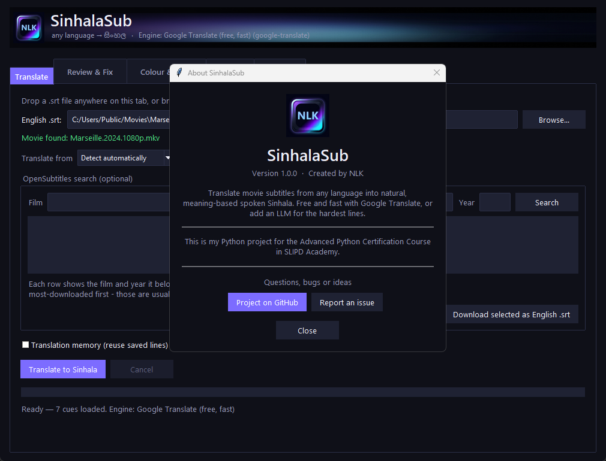

<div align="center">


# SinhalaSub

### Turn a movie subtitle from **any language** into natural, spoken **සිංහල** — in about four minutes, for free.

[](https://www.python.org/)
[](#install)
[](#development)
[](#engines)
[](LICENSE)

*A desktop app that reads an `.srt`, understands the scene, and writes Sinhala a native speaker actually says — then remembers everything it learns.*

**My Python project for the Advanced Python Certification Course at SLIPD Academy.**



</div>

---

## Why this exists

Machine translation turns *"Get out of here, you idiot!"* into something stiff and wrong. Ask an LLM instead and the Sinhala is beautiful — but a two-hour movie takes **35 minutes** and burns your whole usage allowance.

SinhalaSub does both. A free engine handles the bulk in minutes, an LLM is spent **only on the handful of genuinely hard lines**, and every result is saved so the *next* movie is faster and better than the last.

| | Before | SinhalaSub |
|---|---|---|
| *"Get out of here, you idiot!"* | flat, literal | **මෙතනින් යන්න, මෝඩයා!** |
| *"I was going to / tell you the truth"* | "මම **යන්න** හිටියේ" — wrong verb | **මම ඔබට ඇත්ත කියන්නයි හිටියේ** ✓ |
| Full movie | ~35 min, usage gone | **~4 min, free** |

---

## Features

| | |
|---|---|
| 🌍 **Any language → Sinhala** | English, Hindi, Tamil, Telugu, Korean, Japanese, Chinese… or let it auto-detect |
| ⚡ **~4 minutes a movie** | Free engine, 20 requests in parallel |
| 🧠 **It learns** | Fix a line once — it's never wrong again, in any movie |
| 🎨 **Auto colour** | Names, sound cues, each speaker, shouting — each its own colour |
| 📺 **Save for any TV** | SubRip, MicroDVD, WebVTT, ASS/SSA, plain text + encoding choice |
| 📁 **Batch mode** | Point at a season folder and walk away |
| ⏱ **Timing shift** | Fix out-of-sync subtitles in one click |
| ✅ **Quality report** | Catches unreadable timing, bad wrapping, lines left untranslated |
| 🎬 **Finds your movie** | Detects the matching video file automatically |
| 🖱 **Drag & drop** | Drop an `.srt` straight onto the window |

---

## Install

```bash
git clone https://github.com/1118niranjan/SinhalaSub.git
cd SinhalaSub
pip install -r requirements.txt
python main.py
```

Requires **Windows** and **Python 3.11+**. Double-click **`SinhalaSub.pyw`** to launch without a console window.

> **That's it — no API key, no sign-up.** The default engine is free.

---

## Engines

Pick one from the **Providers** menu. All settings live in **Providers → Settings…**

| Engine | Speed (2h movie) | Cost | Quality | Needs |
|---|---|---|---|---|
| **Google Translate** *(default)* | **~4 min** | free | good | nothing |
| **Google + Claude polish** | ~6–10 min | a little Claude usage | better on hard lines | Claude Code CLI |
| **OpenRouter / OpenAI / Local** | ~3–5 min | free tier or cents | best | an API key, or Ollama/LM Studio |

**How the hybrid works:** Google translates everything, then only lines that are **long *and* clause-heavy** go to Claude — capped per batch, worst first. If your Claude allowance runs out it stops asking and quietly finishes on Google, so a run never dies half-done.

<details>
<summary><b>Where do I put an API key?</b></summary>

**In the app:** **Providers → Settings…** → paste the key → **Test connection** → **Save**. There's a **Get a key ↗** button that opens the right page.

**Or in `.env`:** copy `.env.example` to `.env` and fill in your provider's block.

| Provider | Variable | Base URL |
|---|---|---|
| OpenRouter | `OPENAI_API_KEY` | `https://openrouter.ai/api/v1` |
| OpenAI | `OPENAI_API_KEY` | `https://api.openai.com/v1` |
| Ollama | *(none)* | `http://localhost:11434/v1` |
| LM Studio | *(none)* | `http://localhost:1234/v1` |

Keys are stored in `secrets.json` (gitignored, owner-only permissions) and are never committed.

</details>

---

## The translation memory

Every line SinhalaSub translates goes into a local SQLite database — and this is what makes it get better over time.

```
lines        every translation + which engine made it + a quality tier
corrections  lines you fixed by hand — these outrank every engine, forever
names        approved Sinhala spellings, so a character never changes name
history      what you translated, with which engine, how long it took
```

**Quality tiers are the important part.** A cheap machine translation can never overwrite a better one, and a high-quality run won't reuse cheap lines. But the reverse *does* happen — a hard line Claude solved once is reused **free** on every later run:

```
Movie 1  hybrid run → Claude solves a hard line → saved at "llm" quality
Movie 2  free Google run hits the same line   → taken from the database, costs nothing
```

Speed and quality both compound. See it under **Tools → Translation memory…**

---

## Screenshots

<table>
<tr>
<td width="50%"><b>Review & Fix</b><br><sub>Fix a line once — remembered forever</sub><br></td>
<td width="50%"><b>Colour & Style</b><br><sub>Auto-colour names, speakers, sound cues</sub><br></td>
</tr>
<tr>
<td><b>Batch</b><br><sub>A whole season, unattended</sub><br></td>
<td><b>Timing</b><br><sub>Nudge out-of-sync subtitles</sub><br></td>
</tr>
<tr>
<td><b>Provider settings</b><br><sub>Engine, key, glossary, performance</sub><br></td>
<td><b>About</b><br><sub>Created by NLK</sub><br></td>
</tr>
</table>

---

## How it translates well

- **Sentences split across cues are rejoined** before translating. A subtitle that breaks *"I was going to"* / *"tell you the truth"* into two cues makes machine translation guess — and it guesses wrong. Joined, translated, then split back.
- **Markup is protected.** `<i>italics</i>`, speaker dashes and ♪ music symbols are peeled off first so they're never translated as words.
- **SHOUTED LINES are normalised** — translators handle all-caps badly.
- **Nothing pointless is sent.** `[door slams]`, `♪♪` and numbers never leave your machine, and repeated lines ("Yeah.", "Okay.") are translated once and reused.
- **A glossary and learned names** keep places and characters spelled your way, consistently.
- **Alignment is never broken.** If a line fails after retries it keeps its original text — cue numbers and timestamps always match the input exactly.

---

## Saving for old TVs

**Preview → Save as (other formats)…**

| Format | Use it for |
|---|---|
| **`.srt`** | Almost every TV, box and player — **start here** |
| **`.sub`** | Very old DivX-era players (frame-based; pick your FPS) |
| **`.vtt`** | Smart TVs and web players |
| **`.ass`** | Keeps colour and styling |
| **`.txt`** | Just the dialogue |

Also choose the **encoding** — some older TVs only detect UTF-8 when a **BOM** is present.

> ⚠️ **An honest limit:** no file format can add a font to your TV. A set that has no Sinhala font will show boxes whatever you export. If that happens, play through a PC, Chromecast, Fire Stick or an Android box instead.

---

## Good to know

- **Privacy** — the free Google engine sends your subtitle text to Google's public translate endpoint. Fast and free, but the text does leave your machine. A local model via Ollama keeps everything offline.
- **Stability** — that same endpoint is undocumented. If Google ever changes it, switch to OpenRouter or a local model.
- **Cost** — Google is free. OpenRouter has a free tier. The Claude polish uses your existing Claude Code subscription, not per-token billing.

---

## Development

```bash
pip install pytest
python -m pytest -q        # 175 tests, no network needed
```

```
SinhalaSub/
├── main.py                  ← run this
├── SinhalaSub.pyw           ← or double-click this (no console window)
├── requirements.txt
├── assets/                  logo, icon, header artwork
├── docs/screenshots/        the images in this README
├── sinhalasub/              all the application code
│   ├── app.py               GUI, batching, checkpoints, orchestration
│   ├── providers.py         the engines behind one interface
│   ├── memory_db.py         translation memory, corrections, names, history
│   ├── subtitle_text.py     sentence joining, markup handling, glossary
│   ├── colorize.py          cue classification and auto-colour
│   ├── quality.py           subtitling checks (17 cps, 42 chars, 2 lines)
│   └── subtitle_export.py   SRT / SUB / VTT / ASS / TXT writers
└── tests/                   175 tests, no network needed
```

Your own data — `settings.json`, `secrets.json`, `translations.db` — is created
next to `main.py` on first run and is **never** committed (see `.gitignore`).

Interrupted runs resume: progress is checkpointed to `<name>.si.partial.json` after every batch.

---

## Contact

<div align="center">

**Created by NLK**

*This is my Python project for the Advanced Python Certification Course in SLIPD Academy.*

Questions, bugs or ideas? [**Open an issue**](https://github.com/1118niranjan/SinhalaSub/issues) — that's the best way to reach me.

<sub>Also linked in the app under <b>About</b></sub>

</div>

---

## License

MIT — see [LICENSE](LICENSE). Free to use, change and share.
